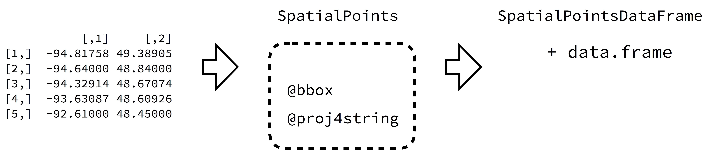
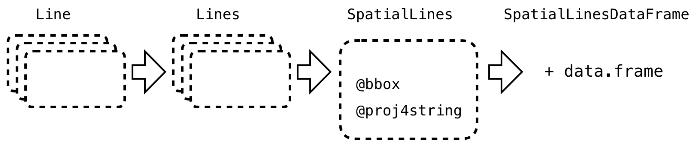
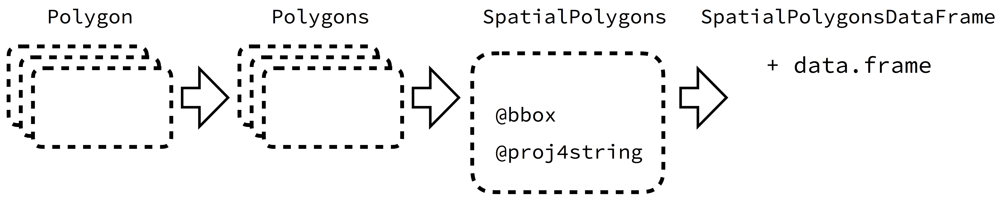

```{r setup, include=FALSE}
## Global code options
knitr::opts_chunk$set(echo=TRUE,
	             cache=TRUE,
               prompt=FALSE,
               tidy=TRUE,
               comment=NA,
               message=FALSE,
               warning=FALSE)

```

## 1. Instalación de librerías.
```{r, echo=FALSE}
# Especificamos las librerías necesarias en esta lista

packages = c("maps","ggmap","leaflet","rgdal","rgeos","maptools","tidyverse","tmap","devtools","formatR","tmaptools","caret",'mapview','cartography')


#use this function to check if each package is on the local machine
#if a package is installed, it will be loaded
#if any are not, the missing package(s) will be installed and loaded
package.check <- lapply(packages, FUN = function(x) {
  if (!require(x, character.only = TRUE)) {
    install.packages(x, dependencies = TRUE,repos='http://cran.rediris.es')
    library(x, character.only = TRUE)
  }
})

#verify they are loaded
search()

```

```{r}

library(ggmap)
library(rgdal)
library(rgeos)
library(maptools)
library(dplyr)
library(tidyr)
library(tmap)
library(geospatial) # Instalado en ejercicios anteriores 
library(sp)
library(maps)
library(raster)
library(tmaptools)
library(leaflet)
library(cartography)
```

---
## 2. Tipos de vectores de datos espaciales en R. **SP package**

Aunque hemos usado datos almacenados en dataframes, no se trata de una estructura de datos adecuada para el almacenamiento de datos geoespaciales porque no pueden contener información del sistema de referencia de coordenadas y, además, la información de GIS es inherentemente jerárquica (continentes, regiones, subregiones, países...) para lo que un dataframe con dos columnas para las coordenadas no es un contenedor óptimo. El tipo *spatial* (**sp**) y recientemente cada vez más el tipo *simple feature*, (**sf**) es más adecuado para representar este tipo de datos. [`sp package`](https://cran.r-project.org/package=sp)[^1]. 

[^1]: R Bivand (2011) [Introduction to representing spatial objects in R](http://geostat-course.org/system/files/monday_slides.pdf)


Se desarrolló en el año 2000 con el objetivo de estandarizar la representación de datos espaciales y facilitar la interoperatividad entre diferentes paquetes de análisis y tratamiento de este tipo de datos en R. Se ha convertido en un estándar y la mayoría de paquetes de análisis y representacón de datos lo utilizan (más de 350).

Proporciona clases para el almacenamiento y manipulación de distintos datos espaciales _points_, _lines_, _polygons_, y _grids_. 


Tenemos 3 tipos de vectores básicos de datos, **puntos**, **líneas** y **polígonos**. Veamos unos ejemplos.

```{r}
px <- c(5, 7, 8, 9, 8, 7, 6) 
py <- c(7, 3, 4, 8, 9, 13, 8)
plot(px,py)
polygon(px, py, col = "khaki1")  # polígono dados los vértices
points(c(6, 6, 8, 8.5), c(9, 4, 8, 9), pch=20, col = "peachpuff4", lwd = 3)
lines(c(5, 6, 7, 8), c(5,8 ,8, 11), col = "steelblue1",  lwd = 3) # línea que une los puntos por orden
lines(c(9, 3), c(4, 12.8), col = "dark green", lwd = 3)
```


Para trabajar con datos espaciales, R utiliza clases que son más complejas que las clases de datos predeterminadas en el paquete base de R; **S3** (vector, lista y data.frame). Se introduce una nueva clase de datos (S3 + campos adicionales -->**S4**). Cada objeto S4 contiene un número de ranuras (*slots*) de datos diferentes.

**Nota:**
S4 es un objeto de R. La clave de la programación orientada a objetos (OO) es la **clase**, que define un tipo de objeto, sus características y su relación con otras clases, y los **methods**, que son funciones cuyo comportamiento depende del tipo de objeto sobre el que se aplica (ejemplo función **summary** cuya salida depende del tipo de dato). Además, los objetos pueden tener una estructura recursiva. Cada uno de los elementos de un objeto se denominan **slots**. [Clase S4](http://adv-r.had.co.nz/OO-essentials.html#s4)

La estructura fundamental para un objeto espacial en __sp__  es la clase `Spatial`, que contiene al menos dos "slots"

+ **bbox**:  una matriz de coordenadas numéricas con nombres de columna c('min', 'max'), y al menos dos filas, con la primera fila `longitud (eje x)` y la segunda fila `latitud (eje y)`. Se utiliza para definir los límites.

+ **proj4string**: es un objeto de clase **CRS** (Coordinate Reference System) que define el sistema de referencia de coordenadas, y su valor por defecto puede ser puesto a 'missing', con la función CRS. `CRS(as.character(NA))`. 


###  I. Creación de objetos SP.

Los objetos más básicos de **sp** son:

__Points__ (pueden tener 2 ó 3 dimensiones), son los más básicos. Puede ser un par, o un conjunto de pares de coordenadas (longitud-latitud). Si son varias puede almacenarse como las columnas de un data frame.   
__Lines__ se genera a partir de una lista ( __list__ ) de uno o más objetos __Line__. Un objeto `Line` es una colección de coordenadas (2D), que siempre son de tipo **float**,  y se generan a partir de una matriz de dos columnas o un dataframe con dos columnas, una de `longitud` y otra de `latitud`.  
__Polygons__ se generan a partir de objetos `Polygon`. Un objeto `Polygon` es una colección de coordenadas (2D) exactamente igual que un objeto __Line__ con la particularidad de que la primera coordenada y la última coinciden, con lo que al unir los puntos "encerramos" un área en su interior. Un objeto `Polygons` es una  __list__ de uno o más objetos  `Polygon`, por ejemplo las islas de un país, las provincias, etc. 

Ejemplo de creación de un objeto `Line`:

```{r}
ln <- Line(matrix(runif(6), ncol=2)) # ha de tener dos columnas
str(ln)
ln@coords
```

Ejemplo de creación de un objeto `Lines`:

```{r}
lns <- Lines(list(ln), ID = "a") # lista que solo contiene una línea!
str(lns)
```

Notar la estructura: tenemos un *slot* Lines y otro ID, accesible mediante \@:

```{r}
lns@Lines
lns@ID
```


###  II. Creación de objetos SpatialPoints, SpatialLines, SpatialPolygons.

Estos objetos se crean a partir de los anteriores (*Points*, *Lines*, *Polygons*) añadiendo unos límites __bounding box__ (se crea automáticamente) en el slot **bbox** y un sistema de coordenadas (CRS), que debe ser añadido manualmente (puede estar vacio) en el slot **proj4string**.

Cada objeto contiene un número de ranuras (*slots*) de datos diferentes que son sub-clases de tipos específicos. Algunas clases espaciales importantes proporcionadas por el paquete `sp` incluyen:

+ **SpatialPoints**: datos de puntos, cada punto representado por una coordenada (longitud,latitud).
+ **SpatialLines**: datos de línea, compuestos de listas de la subclase o ranura (slot) `Líneas`.
+ **SpatialPolygons**: datos de polígonos, con polígonos y slots de polígonos.
+ **SpatialPixels**: una clase espacial para datos **raster** compuesta de píxeles.

Ejemplo de creación de `SpatialPoints`:

```{r}
# just 9 points on a grid:
x <- c(1,1,1,2,2,2,3,3,3)
y <- c(1,2,3,1,2,3,1,2,3)
xy <- cbind(x,y)
S <- SpatialPoints(xy)
str(S)
plot(S)
```


 Ejemplo de creación de un objeto `SpatialLines`:
 
```{r}
sp_lns <- SpatialLines(list(lns))
str(sp_lns)
```

Notar la estructura anidada de listas y objetos *sp*, además de los nuevos slots: bbox y proj4string.

Otro ejemplo de creación de SpatialLines desde cero:

```{r}
 l1 = cbind(c(1,2,3),c(3,2,2)) # vertices de primera linea
l1a = cbind(l1[,1]+.05,l1[,2]+.05) # vertices de segunda linea
l2 = cbind(c(1,2,3),c(1,1.5,1)) # vertices de tercera linea
Sl1 = Line(l1)
Sl1a = Line(l1a)
Sl2 = Line(l2)
S1 = Lines(list(Sl1, Sl1a), ID="a")
S2 = Lines(list(Sl2), ID="b")
Sl = SpatialLines(list(S1,S2))
summary(Sl)
plot(Sl, col = c("red", "blue"))
```


###  III. Añadir más atributos __SpatialXXXXDataFrame__

Estas clases anteriores no pueden contener datos de atributos no espaciales (como tablas de atributos en GIS). Para incluir esta información deben convertirse en una clase del mismo nombre pero con el sufijo *DataFrame*. De esta forma se asocia un data frame que contiene variables ligadas con cada uno de los elementos almacenados en la estructra mediante un `Identificador`. Por ejemplo un __SpatialPolygonDataFrame__ sería una estructura adecuada para almacenar las diferentes regiones de un país y en el dataframe almacenar diversas variables asociadas a cada una de las regiones (población, riqueza...).

+ **SpatialPointsDataFrame** 
+ **SpatialLinesDataFrame**
+ **SpatialPolygonsDataFrame**
+ **SpatialPixelsDataFrame**

La idea se resume en la figura siguiente.




     



Podemos ver los tipos de datos `sp` con **getClass("Spatial")**

```{r}
getClass("Spatial")
```

El siguiente código muestra como se puede crear un `SpatialLinesDataframe`:

Creamos un data frame con la información que queremos asociar al elemento y posteriormente lo vinculamos con los elementos del objeto espacial mediante un identificador **id**.

En este ejemplo usamos el elemento `SpatialLines` *sp_lns* creado previamente y asociamos un data frame con 3 variables (una de ellas ha de ser el identificador de objeto).

El objeto `SpatialLines` tenía como identificador __ID = "a"__ que se asociará con la columna _id_ del data frame. Al combinar se vincularán automáticamente independientemente del orden en que aparezcan en el data frame y en el objeto.

```{r}
dfr <- data.frame(id = "a", use = "road", cars_per_hour = 10) # note how we use the ID from above!
sp_lns_dfr <- SpatialLinesDataFrame(sp_lns, dfr, match.ID = "id")
str(sp_lns_dfr)
```

Ahora podemos almacenar variables como 'use' y 'cars_per_hour' en el nuevo slot __@data__ que no teníamos en el objeto SpatialLines.

###  IV Otros ejemplo de creación de objetos SP.

En general las formas de generar objetos SP puede ser:

+ Desde cero.
+ A partir de un dataframe con columnas longitud y latitud (**coordinates**).
+ Importando un fichero GIS

#### Crear SpatialPoints desde cero

Ejemplo:

Generamos una matriz de valores aleatorios
```{r}
library(sp)
xy <- matrix(data=runif(n=100), ncol=2)
head(xy)
xySp <- SpatialPoints(xy)
summary(xySp)
str(xySp)
```


#### Crear SpatialPointsDataFrame a partir de un dataframe que contiene información de localización geográfica y otras variables.

En este caso asigmamos al dataframe las coordenadas almacenadas en las columnas longitud y latitud con la función **coordinates()**. Observamos que el tipo de dato obtenido pasa de ser un data frame a un **SpatialPointDataFrame**. El dataframe original se transfiere al slot __@data__.

Ejemplo: Crea un SpatialPointsDataFrame a partir del fichero de perros peligrosos.

```{r}
#Escribo todo el código
# dogs<-read_csv('https://data.austintexas.gov/api/views/ykw4-j3aj/rows.csv?accessType=DOWNLOAD')  #YA NO FUNCIONA EL ENLACE
dogs <- read_csv("./data/Declared__Dangerous_Dogs.csv")
head(dogs) # Vemos que podemos extraer las coordenadas de la columna 'Location'

dogs_coords<-separate(dogs, Location, into = c('a','b'),sep = '\\(')%>%
  separate(b, into=c('c','d'),sep='\\)')%>%
  separate(c,into=c('lat','lon'),sep=',')%>%
  dplyr::select(lon,lat)%>%
  sapply(.,as.numeric)%>%
  as.data.frame
dogs<-dplyr::mutate(dogs,lonN=dogs_coords$lon,latN=dogs_coords$lat)
dogs<-dplyr::mutate(dogs,lonN=dogs_coords$lon,latN=dogs_coords$lat) %>% as.data.frame()
head(dogs) # hemos de tener las coordenadas como columnas independientes

spdfDogs<-dogs[complete.cases(dogs),] 
coordinates(spdfDogs)<- ~lonN+latN # o también: c('lonN','latN')
str(spdfDogs,max.level = 2)
```

Nota: *coord.nrs* se refiere a las columnas de *data* de donde proceden las *coords*.


### V. Acceso a los Slots de un objeto **SP**

Aunque ya hemos visto ejemplos, el acceso a los **slots** (elementos) de un objeto SP se puede hacer de varias formas:

1. Similar a las columnas de un data frame pero en lugar de __dataframe$variable__ se utiliza **objetoSP@slot**. 

2. Se puede extraer un elemento determinado de un objeto con **Objeto_SP[1,]** (En este caso el primero de la lista de objetos). El resultado es también un objeto del mismo tipo.

3. Utilizar métodos específicos, para cada slot, en general **slot(Objeto_SP, "slot_name")**, (coordinates, bbox, proj4string, etc). 

####  Ejemplo

Vamos a usar el objeto de tipo SP **countries_sp**  (incluido en la librería `geospatial`, instalable desde github __devtools::install_github("cwickham/geospatial"))__. 


```{r}
if(!suppressWarnings(require('geospatial')))
{devtools::install_github("cwickham/geospatial")} # La instalación no se realiza desde cran sino desde esta ubicación
library(geospatial)
```

Observa la estructura de **countries_sp** con **str()** con **max.level=2**.

```{r}
str(countries_sp,max.level=2)
```

Accede a diferentes slots de **countries_sp** (slot polygons y sus elementos, slot bbox, slot proj4string) usando las diferentes maneras presentadas anteriormente.

```{r}
str(countries_sp[177,])
``` 

#### Ejercicio: Operaciones básicas. 

- Observa la estructura del objeto **canada.cities** incluido en la librería **maps** y los resultados obtenidos al aplicar operaciones básicas (head, class, str). 
- Conviértelo en un **SpatialPointsDataFrame** mediante la asignación de sus coordenadas con **coordinates()**
- Comprueba la estructura del objeto resultante. Represéntalo con plot().
- Accede a los slots bbox y a proj4string. Accede a la columna 'name' de los datos.

```{r}
library(maps)
data(canada.cities)
head(canada.cities)

class(canada.cities)
coordinates(canada.cities)<-~lon+lat 

```

#### Ejercicio. Manejo de objetos SpatialPolygonsDataFrame

1. Utiliza los datos almacenados en el objeto **countries_spdf** de la librería `geospatial`, y examina su estructura con max.level = 2.

```{r}

```

2. Obtén la estructura del **slot** **data**, e identifica el índice de "Switzerland".

```{r}

```

3. Extrae un objeto llamado **one**, que contenga el elemento de **countries_spdf** que está en la posición 50.

```{r}

```

4. Utiliza *plot* sobre el objeto, extraído y observa el mapa. 

```{r}

```

Mas adelante veremos en profundidad la manera de representar mapas con **tmap**. Podemos dibujar el objeto sp con la función **qtm()**:

```{r}
library(tmap)
qtm(one)
```

5. Dibuja los países de countries_spdf en la región "Europe" con plot() y con qtm().

```{r}

```

6. Dibuja los países de **countries_spdf** cuya **population** supera los 40 mill.

```{r}

```

7. Observa el elemento **one<-countries_spdf[169,]** con un max.level = 6. Es del tipo SpatialPolygonsDataFrame, tiene una lista que contiene objetos `Polygons`en el **slot**  polygons, y a su vez cada elemento de la lista tiene un **slot** Polygons. Esto se repite hasta llegar al nivel de 'Polygon' (un solo polígono).

```{r}

```


### VI. Ejercicio. Tornados EEUU

Datos obtenidos de: http://www.spc.noaa.gov/wcm/index.html#data, explicación de cada variable en http://www.spc.noaa.gov/wcm/data/SPC_severe_database_description.pdf

1. Carga el fichero **2009_torn.csv**, que contiene información de los tornados ocurridos en EEUU en 2009. Asigna los nombres de las columnas a: **c("Number", "Year", "Month", "Day", "Date", "Time","TimeZone", "State", "FIPS", "StateNumber", "EFscale", "Injuries", "Fatalities", "Loss", "CLoss", "SLat", "SLon", "ELat", "ELon", "Length", "Width", "NStates", "SNumber", "SG", "1FIPS", "2FIPS", "3FIPS", "4FIPS")**. 

```{r}

```

2. Crea un objeto **SpatialPoints**. Las coordenadas a utilizar están almacenadas en las variables **SLon**, **SLat**. Representa como SpatialPoints las coordenadas de inicio de los tornados (**SLon**, **SLat**) con el CRS por defecto. Visualiza usando plot.

```{r}

```

3. Repite (2) incluyendo como información de la proyección **proj4string = CRS("+proj=longlat")**

```{r}

```

4. Crea un SpatialPointsDataFrame usando la función **SpatialPointsDataFrame**. Las coordenadas serán las mismas pero en este caso el slot @data contendrá al dataframe de datos.

```{r}

```

5. Añade dos nuevas columnas al data frame del slot @data con nombres **IncLon**, **IncLat**, que contengan los incrementos entre el final del tornado (ELon,ELat) y el inicio del tornado (SLon, SLat).

```{r}

```

#### Ejemplo: Trayectoria de tornados

Los datos del tornado incluyen los puntos inicial y final del mismo (cada línea del data frame es un tornado).
Aunque sabemos que éstos no siguen una línea recta, una línea entre origen y final puede ser usada para representar el camino que siguió el tornado.

El siguiente código crea, para cada tornado, un elemento `Line` entre inicio y fin y posteriormente une todas los objetos **Line** en un elemento **Lines** que incluye a todos los tornados. Finalmente se crea un objeto `SpatialLines` a partir de la lista de `Lines`.


```{r}
d <- read.csv(file="./data/2009_torn.csv", header = FALSE)
names(d) <- c("Number", "Year", "Month", "Day", "Date", "Time",
"TimeZone", "State", "FIPS", "StateNumber", "EFscale", "Injuries", "Fatalities", "Loss", "CLoss", "SLat", "SLon", "ELat", "ELon", "Length", "Width", "NStates", "SNumber", "SG", "1FIPS", "2FIPS", "3FIPS", "4FIPS")


# Este código crea un objeto  Line a partir de los puntos inicial y final del origen del tornado y posteriomente crea un Objeto SpatialLines con una lista de todos los objetos Line correspondientes a las trayectorias de cada tornado

sl <- lapply(unique(d$Number), 
             function(X) {
             dd <- d[which(d$Number == X), c("SLon", "SLat", "ELon", "ELat")]  # seleccionamos columnas de localización
L <- lapply(1:nrow(dd), 
            function(i) {
             Line(matrix(as.numeric(dd[i, ]), ncol = 2, byrow = TRUE)) })  # pasamos a numérico y organizamos los pares de coordenadas
Lines(L, ID = as.character(X))
})

Tl <- SpatialLines(sl) 
str(Tl, max.level=2)
plot(Tl) 
# no se ven bien las líneas, cambiamos la bbox para centrarnos en una zona
Tl@bbox<-matrix(c(-100, -80, 35, 40), ncol=2, byrow = TRUE)
plot(Tl) 

```

#### Ejemplo: Representación de metadatos de un SpatialXXXXDataFrame en un mapa.

```{r}
# Cargamos un objeto SpatialPolygonsDataFrame que contiene los polígonos de todos los estados
load("./data/statesth.RData")
str(statesth,max.level = 2)

# Mas adelante veremos otra forma de representar con un paquete similar a ggplot para mapas
#superponemos al gráfico anterior (usamos la librería tmap que comentaremos más adelante)
library(tmap)

# Visualizamos coordenadas de inicio superpuestas al mapa:
Tl.df<-SpatialPointsDataFrame(coords = dplyr::select(d,SLon,SLat),data=d)
sf::sf_use_s2(FALSE) # para evitar un error por la geometría del objeto statesth
qtm(statesth)+qtm(Tl.df)

# Visualizamos Fatalities:
# Más adelante veremos estas opciones
tm_shape(statesth)+
  tm_borders("red", lwd = .5)+
  tm_shape(Tl.df)+
  tm_symbols(col = "blue", size = "Fatalities", scale = .5)
```


